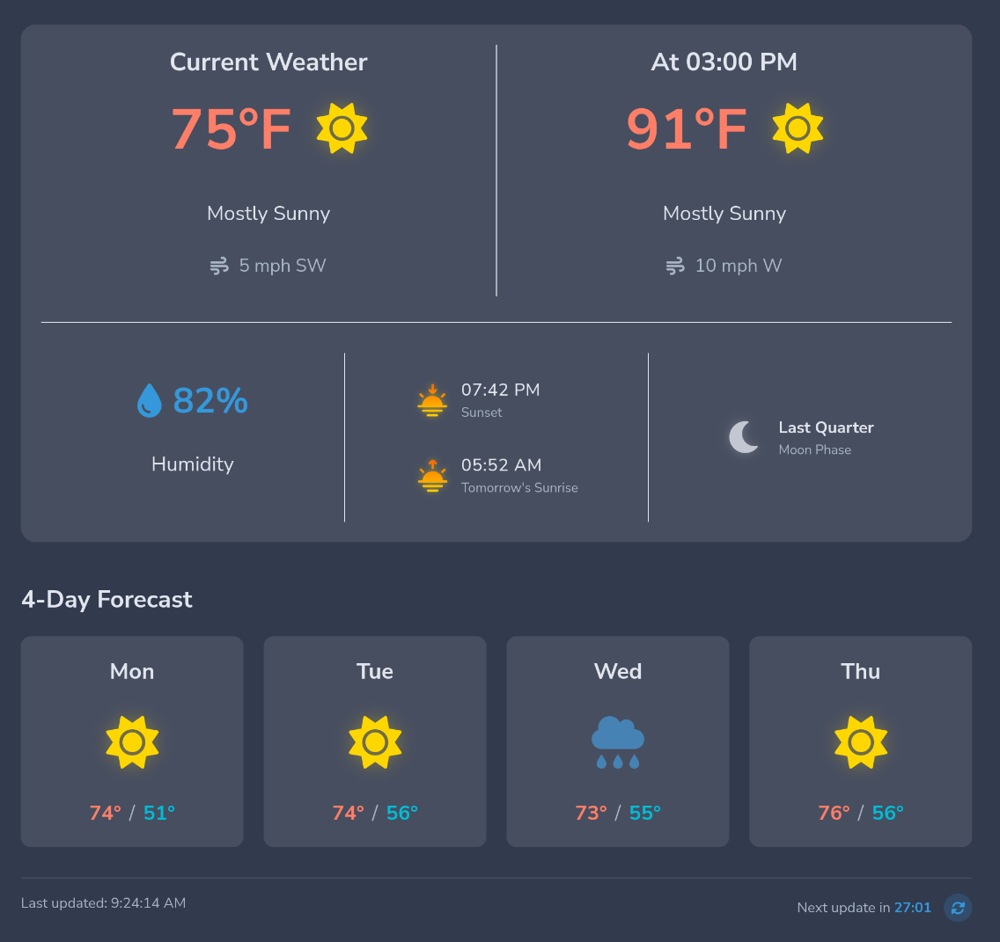

# Webther

A modern, sleek weather dashboard web application built with Flask that displays current weather conditions, forecasts, and astronomy data.



## Features

- **Real-Time Weather Data**: Accurate current weather conditions from the National Weather Service API
- **4-Day Forecast**: Daily high and low temperatures with weather conditions
- **Astronomy Information**: Daily sunset and sunrise times, and moon phase
- **Current Conditions**: Temperature, wind speed and direction, and humidity
- **6-Hour Forecast**: See what the weather will be like in 6 hours
- **Auto-Refresh**: Automatically refreshes data every 30 minutes
- **Manual Refresh**: Allows users to refresh data on demand
- **Dark Theme**: Modern dark UI for comfortable viewing in any lighting condition
- **Responsive Design**: Optimized for desktop and mobile devices

## Technology Stack

- **Backend**: Python 3 with Flask
- **Frontend**: HTML5, CSS3, JavaScript
- **Weather Data**: National Weather Service (weather.gov) API
- **Astronomy Calculations**: Astral library for sunrise, sunset and moon phases
- **Icons**: Font Awesome and custom Flaticon icons
- **Typography**: Nunito Sans font from Google Fonts

## Installation

### Prerequisites

- Python 3.6 or higher
- pip (Python package manager)

### Setup

1. Clone the repository:
   ```bash
   git clone https://github.com/juliegaunt/webther.git
   cd webther
   ```

2. Create a virtual environment (optional but recommended):
   ```bash
   python -m venv venv
   source venv/bin/activate  # On Windows use: venv\Scripts\activate
   ```

3. Install required packages:
   ```bash
   pip install -r requirements.txt
   ```

4. Run the application:
   ```bash
   python app.py
   ```

5. Open your browser and navigate to:
   ```
   http://127.0.0.1:5000/
   ```

## Configuration

The app is currently configured to show weather for the author's location. To change the location:

1. Open `app.py`
2. Modify the coordinates in the `get_weather_data()` function:
   ```python
   # Get coordinates for your location
   lat, lon = YOUR_LATITUDE, YOUR_LONGITUDE
   ```

## Usage

- The dashboard automatically refreshes every 30 minutes
- Click the refresh button to manually update the weather data
- View current temperature, conditions, and wind information
- Look ahead 6 hours to see upcoming weather conditions
- Check humidity percentage
- See today's sunset time and tomorrow's sunrise time
- View current moon phase
- View the 4-day forecast with high and low temperatures

## Dependencies

- Flask: Web framework for Python
- Requests: HTTP library for API calls
- Pytz: Timezone calculations
- Astral: Sunrise, sunset, and moon phase calculations

## Attribution

- Weather icons: [Font Awesome](https://fontawesome.com/)
- Sunrise/Sunset icons: [Flaticon](https://www.flaticon.com/)

## Author

Julie Gaunt

While I designed and conceptualized the application, the code was generated from GitHub Copilot.

---

*Note: This project is not affiliated with the National Weather Service. Weather data is provided by the National Weather Service API.*
